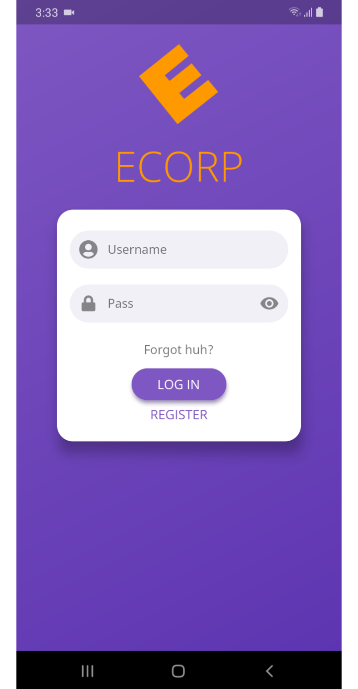
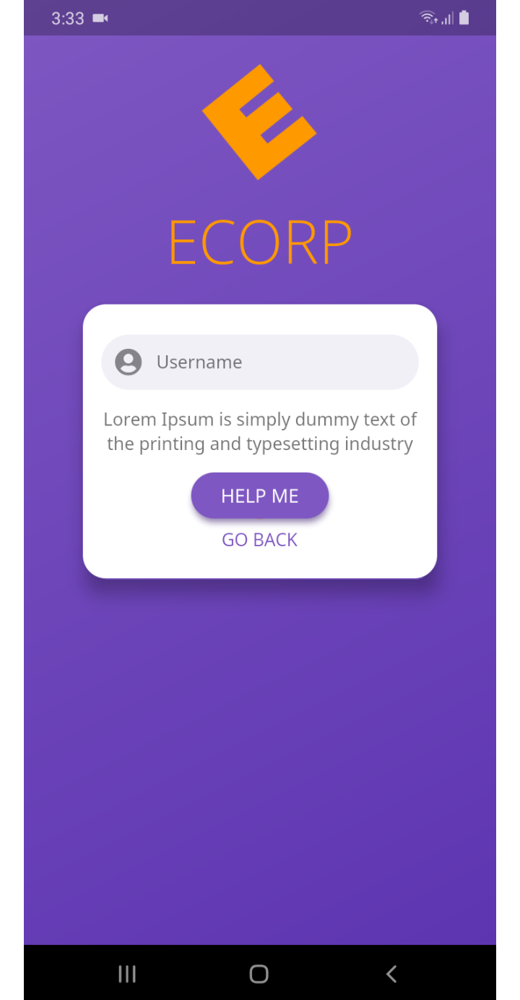

# Flutter Login

`FlutterLogin` is a ready-made login/signup widget with many animation effects to
demonstrate the capabilities of Flutter

<p align="center">
  <a href='https://i.imgur.com/z3FJSe7.mp4'>
    
  </a>
</p>

## Installation

Follow the install instructions [here](https://pub.dev/packages/flutter_login#-installing-tab-)

## Reference

Property |   Type     | Desciption
-------- |------------| ---------------
onSignup |   `AuthCallback`     | <sub>Called when the user hit the submit button when in sign up mode</sub>
onLogin |   `AuthCallback`     | <sub>Called when the user hit the submit button when in login mode</sub>
onRecoverPassword |   `RecoverCallback`     | <sub>Called when the user hit the submit button when in recover password mode</sub>
title |   `String`     | <sub>The large text above the login [Card], usually the app or company name. Leave the string empty or null if you want no title.</sub>
logo |   `String`     | <sub>The path to the asset image that will be passed to the `Image.asset()`</sub>
messages |   [`LoginMessages`](#LoginMessages)     | <sub>Describes all of the labels, text hints, button texts and other auth descriptions</sub>
theme |   [`LoginTheme`](#LoginTheme)     | <sub>FlutterLogin's theme. If not specified, it will use the default theme as shown in the demo gifs and use the colorsheme in the closest `Theme` widget</sub>
emailValidator |   <sub>`FormFieldValidator<String>`</sub>     | <sub>Email validating logic, Returns an error string to display if the input is invalid, or null otherwise</sub>
passwordValidator | <sub>`FormFieldValidator<String>`</sub>     | <sub>Same as `emailValidator` but for password</sub>
<sub>onSubmitAnimationCompleted</sub> |   `Function`     | <sub>Called after the submit animation's completed. Put your route transition logic here</sub>
logoTag |   `String`     | <sub>`Hero` tag for logo image. If not specified, it will simply fade out when changing route</sub>
titleTag |   `String`     | <sub>`Hero` tag for title text. Need to specify `LoginTheme.beforeHeroFontSize` and `LoginTheme.afterHeroFontSize` if you want different font size before and after hero animation</sub>
showDebugButtons |   `bool`     | <sub>Display the debug buttons to quickly forward/reverse login animations. In release mode, this will be overrided to `false` regardless of the value passed in</sub>


*NOTE:* It is recommended that the child widget of the `Hero` widget should be the
same in both places. For title's hero animation use the
`LoginThemeHelper.loginTextStyle` in the next screen to get the style of the
exact text widget in the login screen. `LoginThemeHelper` can be accessed by adding
this line

```dart
import 'package:flutter_login/theme.dart';
```

### LoginMessages

Property |   Type     | Desciption
-------- |------------| ---------------
usernameHint | `String` | Hint text of the user name [TextField]
passwordHint | `String` | Hint text of the password [TextField]
confirmPasswordHint | `String` | Hint text of the confirm password [TextField]
forgotPasswordButton | `String` | Forgot password button's label
loginButton | `String` | Login button's label
signupButton | `String` | Signup button's label
recoverPasswordButton | `String` | Recover password button's label
recoverPasswordIntro | `String` | Intro in password recovery form
recoverPasswordDescription | `String` | Description in password recovery form
goBackButton | `String` | Go back button's label. Go back button is used to go back to to login/signup form from the recover password form
confirmPasswordError | `String` | The error message to show when the confirm password not match with the original password
recoverPasswordSuccess | `String` | The success message to show after submitting recover password

### LoginTheme

Property |   Type     | Desciption
-------- |------------| ---------------
primaryColor | `Color` | The background color of major parts of the widget like the login screen and buttons
accentColor | `Color` | The secondary color, used for title text color, loading icon, etc. Should be contrast with the [primaryColor]
errorColor | `Color` | The color to use for [TextField] input validation errors
cardTheme | `CardTheme` | The colors and styles used to render auth [Card]
inputTheme | `InputDecorationTheme` | Defines the appearance of all [TextField]s
buttonTheme | `LoginButtonTheme` | A theme for customizing the shape, elevation, and color of the submit button
titleStyle | `TextStyle` | Text style for the big title
bodyStyle | `TextStyle` | Text style for small text like the recover password description
textFieldStyle | `TextStyle` | Text style for [TextField] input text
buttonStyle | `TextStyle` | Text style for button text
beforeHeroFontSize | `double` | Defines the font size of the title in the login screen (before the hero transition)
afterHeroFontSize | `double` | Defines the font size of the title in the screen after the login screen (after the hero transition)
pageColorLight | `Color` | The optional light background color of login screen; if provided, used for light gradient instead of primaryColor
pageColorDark | `Color` | The optional dark background color of login screen; if provided, used for dark gradient instead of primaryColor


## Examples

You can view the complete example in the [example project] which resulted in the
gif above

### Basic example

```dart
import 'package:flutter/material.dart';
import 'package:flutter_login/flutter_login.dart';
import 'dashboard_screen.dart';

const users = const {
  'dribbble@gmail.com': '12345',
  'hunter@gmail.com': 'hunter',
};

class LoginScreen extends StatelessWidget {
  Duration get loginTime => Duration(milliseconds: 2250);

  Future<String> _authUser(LoginData data) {
    print('Name: ${data.name}, Password: ${data.password}');
    return Future.delayed(loginTime).then((_) {
      if (!users.containsKey(data.name)) {
        return 'Username not exists';
      }
      if (users[data.name] != data.password) {
        return 'Password does not match';
      }
      return null;
    });
  }

  Future<String> _recoverPassword(String name) {
    print('Name: $name');
    return Future.delayed(loginTime).then((_) {
      if (!users.containsKey(name)) {
        return 'Username not exists';
      }
      return null;
    });
  }

  @override
  Widget build(BuildContext context) {
    return FlutterLogin(
      title: 'ECORP',
      logo: 'assets/images/ecorp-lightblue.png',
      onLogin: _authUser,
      onSignup: _authUser,
      onSubmitAnimationCompleted: () {
        Navigator.of(context).pushReplacement(MaterialPageRoute(
          builder: (context) => DashboardScreen(),
        ));
      },
      onRecoverPassword: _recoverPassword,
    );
  }
}
```


### Basic example with sign in providers

```dart
import 'package:flutter/material.dart';
import 'package:flutter_login/flutter_login.dart';
import 'dashboard_screen.dart';

const users = const {
  'dribbble@gmail.com': '12345',
  'hunter@gmail.com': 'hunter',
};

class LoginScreen extends StatelessWidget {
  Duration get loginTime => Duration(milliseconds: 2250);

  Future<String> _authUser(LoginData data) {
    print('Name: ${data.name}, Password: ${data.password}');
    return Future.delayed(loginTime).then((_) {
      if (!users.containsKey(data.name)) {
        return 'Username not exists';
      }
      if (users[data.name] != data.password) {
        return 'Password does not match';
      }
      return null;
    });
  }

  Future<String> _recoverPassword(String name) {
    print('Name: $name');
    return Future.delayed(loginTime).then((_) {
      if (!users.containsKey(name)) {
        return 'Username not exists';
      }
      return null;
    });
  }

  @override
  Widget build(BuildContext context) {
    return FlutterLogin(
      title: 'ECORP',
      logo: 'assets/images/ecorp-lightblue.png',
      onLogin: _authUser,
      onSignup: _authUser,
      
        loginProvidersList: <LoginProvider>[
          LoginProvider(
            icon: FontAwesomeIcons.google,
            callback: () async {
              print('start google sign in');
              await Future.delayed(loginTime);
              print('stop google sign in');              
              return null;
            },
          ),
          LoginProvider(
            icon: FontAwesomeIcons.facebookF,
            callback: () async {            
              print('start facebook sign in');
              await Future.delayed(loginTime);
              print('stop facebook sign in');              
              return null;
            },
          ),
          LoginProvider(
            icon: FontAwesomeIcons.linkedinIn,
            callback: () async {         
              print('start linkdin sign in');
              await Future.delayed(loginTime);         
              print('stop linkdin sign in');              
              return null;
            },
          ),
          LoginProvider(
            icon: FontAwesomeIcons.githubAlt,
            callback: () async {
              print('start github sign in');
              await Future.delayed(loginTime);
              print('stop github sign in');              
              return null;
            },
          ),
        ],
      onSubmitAnimationCompleted: () {
        Navigator.of(context).pushReplacement(MaterialPageRoute(
          builder: (context) => DashboardScreen(),
        ));
      },
      onRecoverPassword: _recoverPassword,
    );
  }
}
```


### Theming via `ThemeData`

Login theme can be customized indectly by using `ThemeData` like this

```dart
// main.dart
import 'package:flutter/material.dart';
import 'login_screen.dart';

void main() => runApp(MyApp());

class MyApp extends StatelessWidget {
  @override
  Widget build(BuildContext context) {
    return MaterialApp(
      title: 'Login Demo',
      theme: ThemeData(
        primarySwatch: Colors.deepPurple,
        accentColor: Colors.orange,
        cursorColor: Colors.orange,
        textTheme: TextTheme(
          display2: TextStyle(
            fontFamily: 'OpenSans',
            fontSize: 45.0,
            color: Colors.orange,
          ),
          button: TextStyle(
            fontFamily: 'OpenSans',
          ),
          subhead: TextStyle(fontFamily: 'NotoSans'),
          body1: TextStyle(fontFamily: 'NotoSans'),
        ),
      ),
      home: LoginScreen(),
    );
  }
}

// login_screen.dart
import 'package:flutter/material.dart';
import 'package:flutter_login/flutter_login.dart';
import 'dashboard_screen.dart';

class LoginScreen extends StatelessWidget {
  @override
  Widget build(BuildContext context) {
    return FlutterLogin(
      title: 'ECORP',
      logo: 'assets/images/ecorp.png',
      onLogin: (_) => Future(null),
      onSignup: (_) => Future(null),
      onSubmitAnimationCompleted: () {
        Navigator.of(context).pushReplacement(MaterialPageRoute(
          builder: (context) => DashboardScreen(),
        ));
      },
      onRecoverPassword: (_) => Future(null),
    );
  }
}
```


### Custom labels

```dart
import 'package:flutter/material.dart';
import 'package:flutter_login/flutter_login.dart';
import 'dashboard_screen.dart';

class LoginScreen extends StatelessWidget {
  @override
  Widget build(BuildContext context) {
    return FlutterLogin(
      title: 'ECORP',
      logo: 'assets/images/ecorp.png',
      onLogin: (_) => Future(null),
      onSignup: (_) => Future(null),
      onSubmitAnimationCompleted: () {
        Navigator.of(context).pushReplacement(MaterialPageRoute(
          builder: (context) => DashboardScreen(),
        ));
      },
      onRecoverPassword: (_) => Future(null),
      messages: LoginMessages(
        usernameHint: 'Username',
        passwordHint: 'Pass',
        confirmPasswordHint: 'Confirm',
        loginButton: 'LOG IN',
        signupButton: 'REGISTER',
        forgotPasswordButton: 'Forgot huh?',
        recoverPasswordButton: 'HELP ME',
        goBackButton: 'GO BACK',
        confirmPasswordError: 'Not match!',
        recoverPasswordDescription:
            'Lorem Ipsum is simply dummy text of the printing and typesetting industry',
        recoverPasswordSuccess: 'Password rescued successfully',
      ),
    );
  }
}
```

Login/Signup | Password Recovery
:-------:|:-------:
  |  

### Theme customization

```dart

import 'package:flutter/material.dart';
import 'package:flutter_login/flutter_login.dart';
import 'dashboard_screen.dart';

class LoginScreen extends StatelessWidget {
  @override
  Widget build(BuildContext context) {
    final inputBorder = BorderRadius.vertical(
      bottom: Radius.circular(10.0),
      top: Radius.circular(20.0),
    );

    return FlutterLogin(
      title: 'ECORP',
      logo: 'assets/images/ecorp-lightgreen.png',
      onLogin: (_) => Future(null),
      onSignup: (_) => Future(null),
      onSubmitAnimationCompleted: () {
        Navigator.of(context).pushReplacement(MaterialPageRoute(
          builder: (context) => DashboardScreen(),
        ));
      },
      onRecoverPassword: (_) => Future(null),
      theme: LoginTheme(
        primaryColor: Colors.teal,
        accentColor: Colors.yellow,
        errorColor: Colors.deepOrange,
        titleStyle: TextStyle(
          color: Colors.greenAccent,
          fontFamily: 'Quicksand',
          letterSpacing: 4,
        ),
        bodyStyle: TextStyle(
          fontStyle: FontStyle.italic,
          decoration: TextDecoration.underline,
        ),
        textFieldStyle: TextStyle(
          color: Colors.orange,
          shadows: [Shadow(color: Colors.yellow, blurRadius: 2)],
        ),
        buttonStyle: TextStyle(
          fontWeight: FontWeight.w800,
          color: Colors.yellow,
        ),
        cardTheme: CardTheme(
          color: Colors.yellow.shade100,
          elevation: 5,
          margin: EdgeInsets.only(top: 15),
          shape: ContinuousRectangleBorder(
              borderRadius: BorderRadius.circular(100.0)),
        ),
        inputTheme: InputDecorationTheme(
          filled: true,
          fillColor: Colors.purple.withOpacity(.1),
          contentPadding: EdgeInsets.zero,
          errorStyle: TextStyle(
            backgroundColor: Colors.orange,
            color: Colors.white,
          ),
          labelStyle: TextStyle(fontSize: 12),
          enabledBorder: UnderlineInputBorder(
            borderSide: BorderSide(color: Colors.blue.shade700, width: 4),
            borderRadius: inputBorder,
          ),
          focusedBorder: UnderlineInputBorder(
            borderSide: BorderSide(color: Colors.blue.shade400, width: 5),
            borderRadius: inputBorder,
          ),
          errorBorder: UnderlineInputBorder(
            borderSide: BorderSide(color: Colors.red.shade700, width: 7),
            borderRadius: inputBorder,
          ),
          focusedErrorBorder: UnderlineInputBorder(
            borderSide: BorderSide(color: Colors.red.shade400, width: 8),
            borderRadius: inputBorder,
          ),
          disabledBorder: UnderlineInputBorder(
            borderSide: BorderSide(color: Colors.grey, width: 5),
            borderRadius: inputBorder,
          ),
        ),
        buttonTheme: LoginButtonTheme(
          splashColor: Colors.purple,
          backgroundColor: Colors.pinkAccent,
          highlightColor: Colors.lightGreen,
          elevation: 9.0,
          highlightElevation: 6.0,
          shape: BeveledRectangleBorder(
            borderRadius: BorderRadius.circular(10),
          ),
          // shape: RoundedRectangleBorder(borderRadius: BorderRadius.circular(5)),
          // shape: CircleBorder(side: BorderSide(color: Colors.green)),
          // shape: ContinuousRectangleBorder(borderRadius: BorderRadius.circular(55.0)),
        ),
      ),
    );
  }
}
```


## Inspiration
* [VNPAY App Interactions](https://dribbble.com/shots/3829985-VNPAY-App-Interactions)
* [Flat UI Login animated](https://dribbble.com/shots/1058688-Flat-UI-Login-animated)

## License

* MIT License

[example project]: example/
